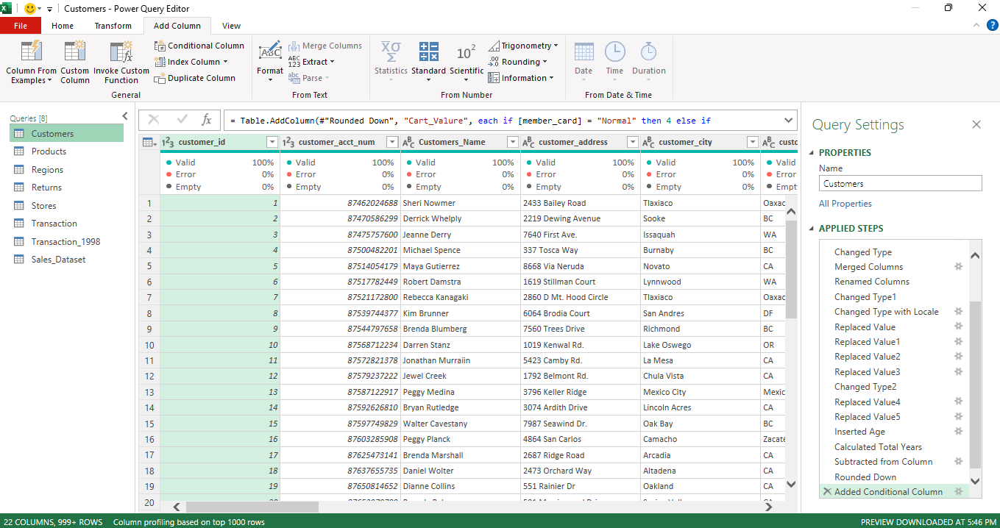
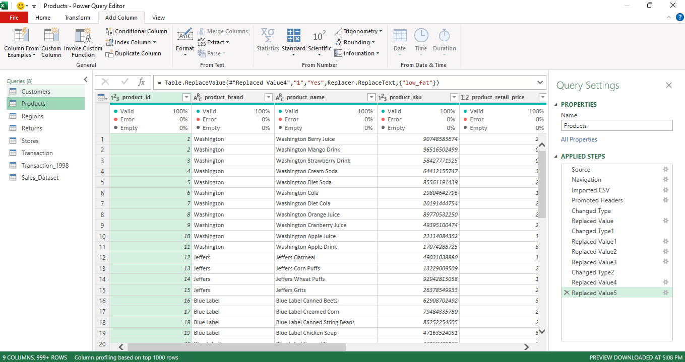
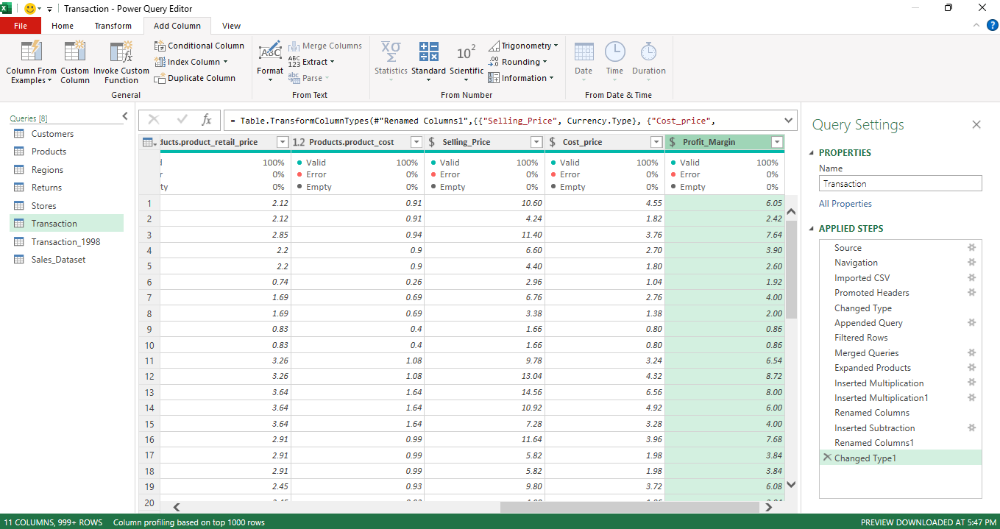

## Data Cleaning Process using Power Query (Excel & Power BI)

This repository demonstrates a complete **Data Cleaning and Data Transformation process** using **Power Query Editor** in both **Microsoft Excel** and **Power BI**.

Power Query is a powerful ETL (Extract, Transform, Load) tool that helps convert raw and unstructured data into clean, organized, and analysis-ready datasets.

##  Objective

The main objective of this work is to clean raw datasets and prepare them for reporting, dashboard creation, and data analysis.

## Tools Used

* Microsoft Excel (Power Query)
* Power BI (Power Query Editor)

## Datasets Used

The following datasets were used during the cleaning process:

* Customers
* Products
* Regions
* Returns
* Stores
* Transactions

## Data Cleaning Steps Performed

### 1. Data Type Correction

* Changed incorrect column data types
* Converted text to numbers/dates where required

### 2. Handling Missing Data

* Replaced null values
* Filled blank values
* Removed unnecessary empty rows

### 3. Error Handling

* Replaced or removed error values

### 4. Column Transformations

* Renamed columns for better readability
* Reordered columns
* Removed unwanted columns

### 5. Custom Columns

* Added calculated columns using formulas
* Created conditional columns based on business rules

### 6. Formatting

* Rounded numeric values
* Standardized text values

### 7. Data Quality Checks

* Used column profiling tools
* Checked valid, error, and empty value

## Outcome

After cleaning, the datasets became:

* Structured
* Consistent
* Error-free
* Ready for dashboards
* Ready for business insights

## Screenshots

Add your screenshots in this section:

## Tags

`Power Query` `Excel` `Power BI` `Data Cleaning` `ETL` `Data Analytics`
